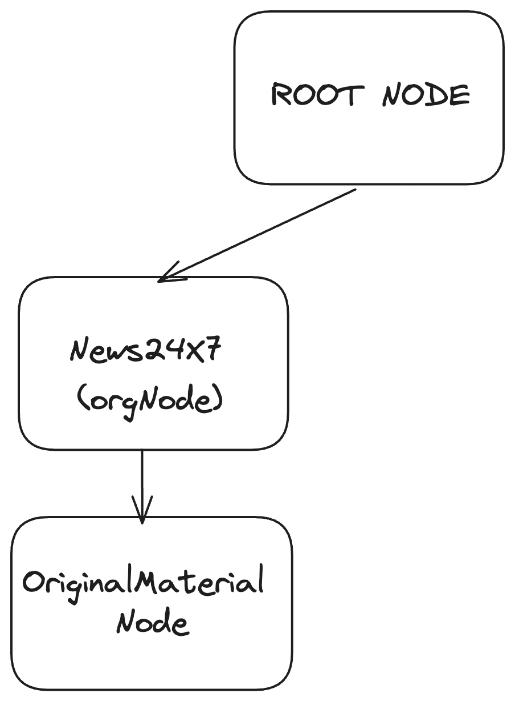
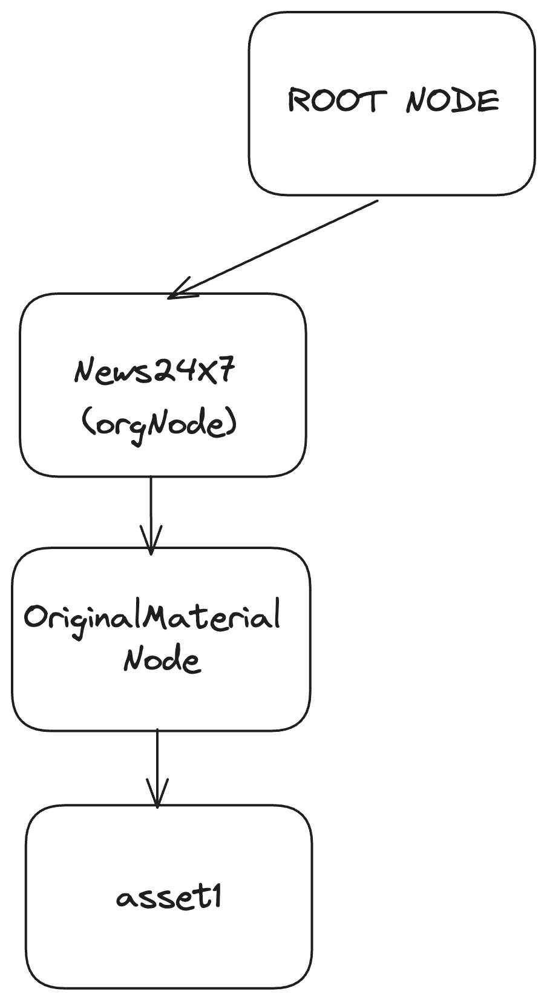
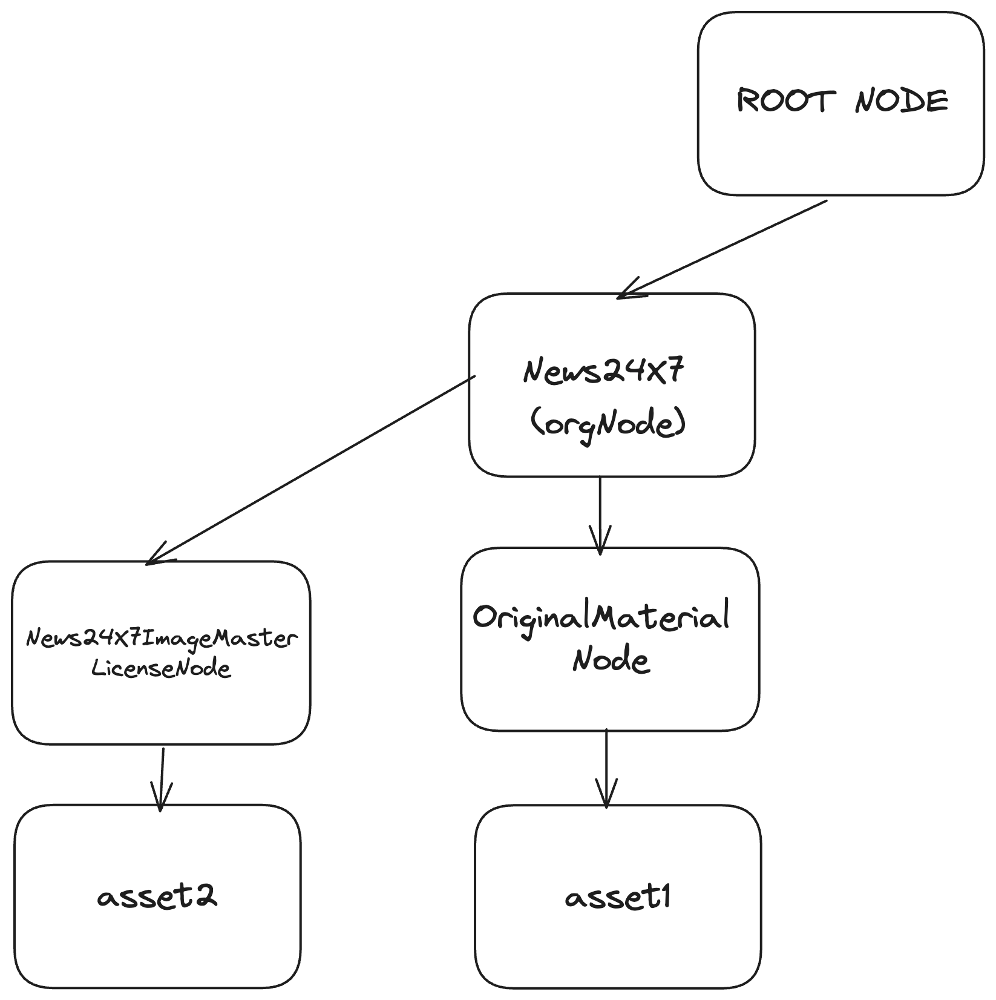

## Example
Let's consider the case of a publisher, News24X7, aiming to publish articles via the Verify protocol. News24X7 both generates original content and licenses content from other publishers.

_<b>Note: asset ownership has to be informed in the article payload by the publisher using the fields ownership and licensedFrom: [ref](https://sdk.verifymedia.com/types/types_schema.ContentMetadata.html)</b>_

### Setting up the publisher identities and org structure
Following the steps outlined in the  [getting started](https://github.com/verify-media/verify-client/blob/main/GETTING_STARTED.md) guide the initial phase involves setting up publisher identities and the organizational structure. This involves creating an orgNode and an OriginalMaterialNode.



### Publishing an article
Let's consider an article comprising two image assets and the article body itself, along with associated metadata. One image asset is created by News24X7, while the other is licensed from another publisher, say ImageMaster. The workflow entails:

### step 1

The article is divided into three parts: the article body, image1, and image2. Images are treated as image assets, while the article body is a text asset.

### step 2

After processing the assets (e.g., encryption, IPFS uploads), they are published on the Verify protocol following a hierarchical structure:

<b>Asset#1</b>: An image asset owned by News24X7 is published under the OriginalMaterialNode of News24X7, with the Node ID being the hash of the raw image data.



<b>Asset#2</b>: An image asset licensed by News24X7 from ImageMaster is published under a licenseNode of ImageMaster X News24X7 under the OrgNode, with the Node ID being the hash of the raw image data. This is done in cases where ImageMaster is not yet on the protocol. Once ImageMaster joins the protocol, ownership of the licenseNode (and its content) can be transferred.



### step 3

The article body and metadata, along with asset references (asset node IDs), are represented in a custom XML structure and published as a text asset node.

```xml
  <article>
    <header>
      <version>1.0.0</version>
      <title>${title}</title>
      <description>${description}</description>
      <datePublished>${datePublished}</datePublished>      
      <id>${id}</id>
      <canonicalUrl>${uri}</canonicalUrl>
      <publishedBy>${origin}</publishedBy>
    </header>
    <main>
      <section>
        ${articleBody}
      </section>
    </main>
    <contents>
      <image>
        <title>${title}</title>
        <contentType>${contentType}</contentType>
        <description>${description}</description>
        <creditedSource>${creditedSource}</creditedSource>
        <hash>${Asset#1}</hash>
      </image>`
      <image>
        <title>${title}</title>
        <contentType>${contentType}</contentType>
        <description>${description}</description>
        <creditedSource>${creditedSource}</creditedSource>
        <hash>${Asset#2}</hash>
      </image>`
    </contents>
  </article>
```

To maintain context and provenance, the text asset node is published under an article node under the OriginalMaterialNode of News24X7. The article Node ID is a unique ID generated by publisher (it could be the CMS id or canonical uri etc.), while the asset Node ID is the hash of the raw data (XML structure).


By following this workflow, News24X7 successfully publishes an article on the Verify protocol. The article is represented in a manner ensuring its context, provenance, and usage are preserved over time.

Any updates to the article result in a new text asset node representing the updated article, with all asset references published under the same article node.

